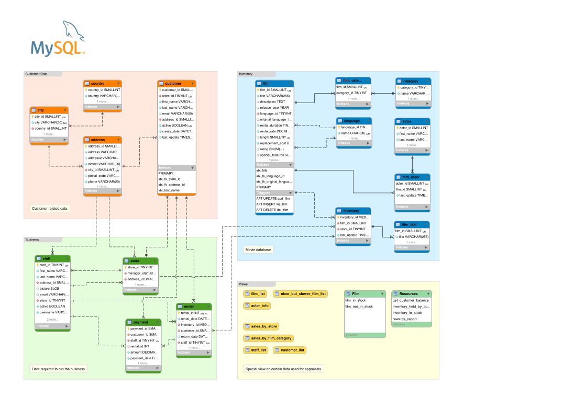

# Workshop
This workshop will walk students through the SQL language and how to interact
with data in and out of traditional development environments. No prior knowledge
of SQL is required, through it wouldn't hurt.

The minimum requirement is crude appreciation of tabular information like spreadsheets
or hand written tables. If the following table makes sense, then you're ready to
take the plunge into SQL.

| Thing    | Width | Height | Length |
|----------|-------|--------|--------|
| Book     | 1     | 6      | 4      |
| Box      | 5     | 5      | 5      |
| Building | 500   | 1000   | 500    |

## Why Learn SQL?
SQL (Structured Query Language) is an old language, but it's everywhere and it's
not going away anytime soon. Feel free to search "Why Learn SQL?" and read until
you're convinced.

## Terms and Concepts

- dataset :: 2 dimensional representation of data.

- table :: a dataset persisted in the database usually with column definitions.

- normalized data :: data which has been structured to reduce redundancy and
  improve integrity.

## SQL Playground

### Connect to SQL Playground

Open a browser to https://sakila.dataturd.com. It will prompt you for a name.
Enter a somewhat unique name, otherwise you'll pick up someone else's session.
We'll be doing all our queries from this site so you may want to bookmark it.
Your data will be on the site until the next workshop so backup anything you'd
like to save in your personal notes.

### What the Sakila?!?

The `sakila` schema was created MySQL and Oracle to represent an online DVD
store. It contains normalized using best data organization practices.

From the very first queries, you should notice many tables first columns are unique
numbers. These are `primary keys` which are used to reference the row in another
table. Data normalization principles and strategies are out of scope for this
workshop, but can be read in depth at https://en.wikipedia.org/wiki/Database_normalization.

Due to the normalized nature of the Sakila schema, our initial queries will be
quite bland. Once we get into using joins, our result sets will start to be more
interesting. Please be patient.

## Anatomy of the `SELECT` Statement

<figure>
  
  <figcaption><a href="http://www.sqlite.org/lang_select.html">SELECT statement diagram provided by SQLite</a></figcaption>
</figure>

This map of possible keywords is menacing at first, but by the of this session
you'll be able to use these terms to retrieve the data needed.

### SELECT .. FROM

Let's jump right and build out the first query.

1. Start a new query by selecting the `New Query` in the upper right corner.
2. Type the following text in the black box `SELECT * FROM country`.
3. Select `Run` or use the keyboard shortcut `Ctrl-Enter` on Windows/Linux or `⌘-Enter` on OSX.

The results of the query will display 

<figure>

<figcaption><a href="http://www.sqlite.org/lang_select.html">Diagram of result-column</a></figcaption>
</figure>

1. List all actors.

2. List all films.

3. List all customers.

### .. WHERE

1. List G rated films.

#### .. LIKE

1. List movies safe for teens (less than R)

2. List rentals between 5 and 10 dollars.

3. List addresses in the East Coast.

### .. ORDER BY [ASC | DESC] [LIMIT ..]

### .. LIMIT

### .. JOIN

This is how we relate from data from separate tables into a larger dataset.

1. List films with their language names.

2. List actors first and last name with their film.

3. List customers with their postal code.

#### INNER JOIN (default)

#### LEFT JOIN

1. List customers who don't have a rental.

2. List films without inventory.

#### FULL OUTER JOIN

1. Which category doesn't have a film and which film doesn't have a category?

### .. GROUP BY

#### Aggregate Functions

##### COUNT, SUM, AVG

https://www.postgresql.org/docs/9.3/static/functions-aggregate.html

#### .. HAVING

### .. UNION

### SELECT (SELECT .. ) FROM

## Functions

Functions are used to format or transform columns into something more desirable.

+ String Functions - https://www.postgresql.org/docs/9.3/static/functions-string.html
+ Math Functions - https://www.postgresql.org/docs/9.3/static/functions-math.html
+ Date Functions - https://www.postgresql.org/docs/9.3/static/functions-formatting.html
+ Misc - https://www.postgresql.org/docs/9.3/static/functions.html

### repeat()

Making a bar graph

### concat(), `||`

Make a full name

## Changing Data

### INSERT .. INTO

### DELETE .. FROM

### UPDATE .. SET

## Defining a Schema

https://www.postgresql.org/docs/9.3/static/ddl.html

### CREATE TABLE

### DROP TABLE

## Challenges

